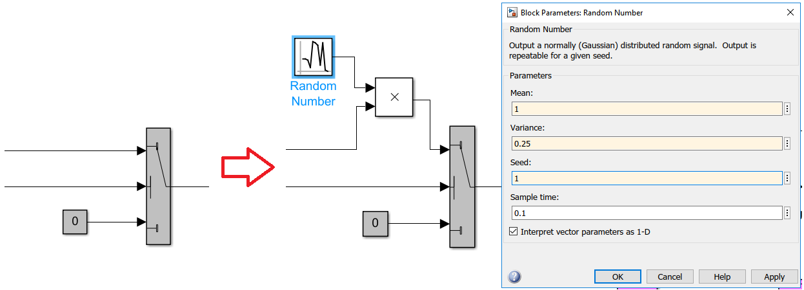
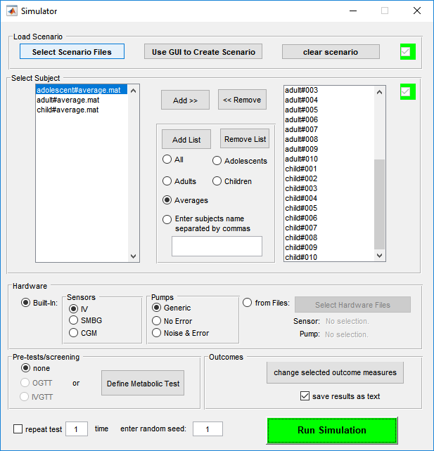

# GLYFE (GLYcemia Forecasting Evaluation)

[](https://zenodo.org/badge/latestdoi/184261006)

GLYFE is a glucose predictive models benchmark. <!--It has been described in the paper "GLYFE: Benchmark of Personalized Glucose
Predictive Models in Type 1 Diabetes", published in IEEE Transactions on Biomedical Engineering.-->

## Getting Started

These instructions will help you get the data needed to run the benchmark as well as to develop new glucose predictive models.

### Prerequisites

To simulate the data need to run the benchmark, you will need a [MATLAB](https://fr.mathworks.com/products/matlab.html) (R2018b has been used) and a [T1DMS licence](https://tegvirginia.com/software/t1dms/) (v3.2.1).

To run the benchmark, you will need the following ```Python 3.6``` libraries
```
Keras 2.2.4
matplotlib 3.0.3
numpy 1.16.3
pandas 0.23.4
patsy 0.5.1
pip 9.0.1
scikit-learn 0.20.1
scipy 1.2.1
setuptools 28.8.0
statsmodels 0.9.0
tensorboard 1.13.1
tensorflow-gpu 1.13.1
```

### Data Simulation

#### Setup the environment

* Copy and paste the ```GLYFE/T1DMS/GLYFE.scn``` scenario file into the ```scenario``` folder of the T1DMS installation folder (named ```UVa PadovaT1DM Simulator v3.2.1```). The files describes the scenario the virtual patients will follow during the simulation.
* Copy and paste the ```./T1DMS/results2csv.m``` file into the T1DMS installation folder.
* Modify the Simulink schematics:
  * Open the file ```testing_platform.slx``` under the T1DMS installation folder in Matlab.
  * Double click the "STD_Treat_v3_2" big orange block.
  * Modify the schematics as follows:
  


#### Launch Simulation

* In the Matlab console type ```rng(1,"twister")```
* Launch the T1DMS GUI by typing ```Simulator```
* In the GUI:
  * Load Scenario: ```Select Scenario Files``` => ```GLYFE.scn```
  * Select Subject: ```Add List > All``` and then ```Remove List > Averages```
  * Hardware: ```Built-in```
   * Sensors: ```IV```
   * Pumps: ```Generic```
  * Pre-tests/screening: ```none```
  * enter random seed: ```1```
  


* Click on ```Run Simulation``` (it may take several hours, updates are displayed in the console)
* After the simulation has ended:
  * Convert the results files (give name) into CSV by running
  * On the resulting folder, compute the SHA256 checksum and make sure it equals: ```658BDBFF19021E3C547F5CB0C9511390281ADDAA882A1E26E9726EB5243FC077```

 * Copy the folder into the ```GLYFE``` folder.

## How to use the benchmark

There are two different ways to use the benchmark code: either rerun the models presented on the original paper or run the benchmark on new models.

### Run the benchmark on an existing model

Go in the GLYFE directory and run the command: ```python main.py --subject={subject} --model={model} --ph={ph} --params={params} --log={logs}``` where:
* ```subject``` is the name of the subject on which the benchmark will be run on (```child#001``` to ```child#010```, ```adolescent#001``` to ```adolescent#010```, and ```adult#001``` to ```adult#010```);
* ```model``` is the name of the model to be used; the following are implemented: ```arimax```, ```base```, ```elm```, ```ffnn```, ```gp```, ```lstm```, ```poly```, ```svr```;
* ```ph``` is the prediction horizon (in minutes); in the benchmark, values of ```30```, ```60```, and ```120``` have been used;
* ```params``` (optional) gives the name of an alternative parameter file (in the ```params``` folder) to the default parameter file (which is the same as the name of the model);
* ```logs``` (optional) specifies the file in which the logs of the benchmark shall be written in (inside the ```logs``` directory); by default, the logs are printed in the console;

One can run several subjects, models, or prediction horizons at once by using the ```run_batch``` function.

### Create a new model

To create a new model, one should follow these steps:
* Create the model:
  * Create a file inside the ```models``` directory, its name should be the name of the model and to be lowercase;
  * Inside the created file, create a class which name should be the name of the file (uppercase); it should inherit the ```models.predictor.Predictor``` class;
  * Override the functions ```fit```, ```predict``` (and ```_reshape``` if needed) following the instructions in  ```models._template.npy```;
* Create the parameter file:
  * Create a file with the same name as the model (lowercase) in the ```params``` directory;
  * Inside the created file, create two dictionaries named ```parameters``` and ```search```:
    * ```parameters``` represents the hyperparameters of the model; one can look at ```models._template.npy``` to see how to fill it;
    * ```search``` represents the list of the hyperparameters that are automatically optimized with the coarse-to-fine methodology presented in the paper; as for the ```params``` dictionary, one can look at the ```_template``` file to fill it;
* To run the benchmark on the newly created model, just run the ```main``` function with the name of the model as the ```model``` parameter!

# TODO

* Add References section;
* Update introduction;
* Change the DOI of the repository once the paper is submitted;
* Provide with the DOI of the paper once published;
