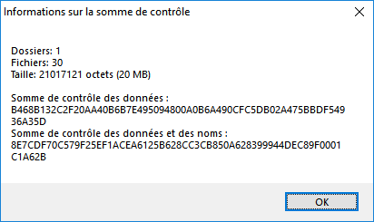

# GLYFE (GLYcemia Forecasting Evaluation)

[](https://zenodo.org/badge/latestdoi/184261006)

GLYFE is a glucose predictive models benchmark.

## Getting Started

These instructions will help you get the data needed to run the benchmark as well as to develop new glucose predictive models.

### Prerequisites

To simulate the data need to run the benchmark, you will need a [MATLAB](https://fr.mathworks.com/products/matlab.html) (here, the R2018b version under Windows has been used) and a [T1DMS licence](https://tegvirginia.com/software/t1dms/) (v3.2.1).

To run the benchmark, you will need the following ```Python 3.7.6``` libraries
```
matplotlib 3.1.3
numpy 1.18.1
pandas 1.0.1
patsy 0.5.1
pip 20.0.1
pytorch 1.4.0
scikit-learn 0.22.1
scipy 1.4.1
setuptools 45.2.0
statsmodels 0.12.0.dev0
```

### OhioT1DM Data Obtaining

* To access the OhioT1DM data, one should refer to the [paper by Marling et al](http://ceur-ws.org/Vol-2148/paper09.pdf).
* Once obtained, the two folders ```OhioT1DM-testing``` and ```OhioT1DM-training``` should be place under the ```./data/ohio/``` directory (create if needed).

### T1DMS Data Simulation

#### Setup the environment

* Copy and paste the ```GLYFE/T1DMS/GLYFE.scn``` scenario file into the ```scenario``` folder of the T1DMS installation folder (named ```UVa PadovaT1DM Simulator v3.2.1```). The file describes the daily scenario the virtual patients will follow during the simulation.
* Copy and paste the ```./T1DMS/results2csv.m``` file into the T1DMS installation folder.
* Modify the Simulink schematics:
  * Open the file ```testing_platform.slx``` under the T1DMS installation folder in Matlab.
  * Double click the "STD_Treat_v3_2" big orange block.
  * Modify the schematics as follows:
  


#### Launch Simulation

* In the Matlab console type ```rng(1,"twister")```
* Launch the T1DMS GUI by typing ```Simulator```
* In the GUI:
  * Load Scenario: ```Select Scenario Files``` => ```GLYFE.scn```
  * Select Subject: ```Add List > Adults ``` <!--and then ```Remove List > Averages```-->
  * Hardware: ```Built-in```
   * Sensors: ```CGM```
   * Pumps: ```Generic```
  * Pre-tests/screening: ```none```
  * enter random seed: ```1```
  


* Click on ```Run Simulation``` (it may take several hours, updates are displayed in the console)
* After the simulation has ended:
  * Say OK to the pop-up asking for a file name; the results are contained in the ```sim_results.mat``` file;
  * Convert the results files (give name) into CSV by running ```results2csv("sim_results.mat","t1dms_adult")```. The resulting files are located in the ```data``` folder;
  * Compute the SHA-256 (data) checksum of the ```t1dms_adult``` folder and make sure it equals: ```8E7A26F7DB5B3B627AD4838D796ED9AF2C8DD90981B0EDE8A7C34D9EA``` (checksum on data only) or ```6DA007A0D5E4EEEDFF9D350796A2D9AD52CD331749ABF8C7E565AF345791824D``` (checksum on data and names)
  


 * Copy the ```t1dms_adult```folder into the ```GLYFE``` folder.

## How to use the benchmark

There are two different ways to use the benchmark code: either rerun the models presented on the original paper or run the benchmark on new models.

### Run the benchmark on an existing model

Go in the GLYFE directory and run the command: ```python main.py --dataset={dataset} --subject={subject} --model={model} --ph={ph} --params={params} --exp={exp} --mode={mode} --plot={plot} --log={logs}``` where:
* ```dataset``` is the name of the dataset on which the subject will be selected (either ```t1dms_adult``` or ```ohio```
* ```subject``` is the name of the subject on which the benchmark will be run on (```1``` to ```10``` for the ```t1dms_adult``` dataset, and ```559```, ```563```, ```570```, ```575```, ```588```, ```591``` for the ```ohio``` dataset);
* ```model``` is the name of the model to be used; the following are implemented: ```arimax```, ```base```, ```elm```, ```ffnn```, ```gp```, ```lstm```, ```poly```, ```svr```;
* ```ph``` is the prediction horizon (in minutes); in the benchmark, values of ```30```, ```60```, and ```120``` have been used;
* ```exp``` name of the experimental run, to keep track of different tries for the same model;
* ```mode``` either ```valid``` or ```test```, specifies wether the evaluation is to be made on the validation or testing set;
* ```params``` (optional) gives the name of the parameter file (in the ```./processing/params``` folder) to use  (by default it has the same name as the name of the model);
* ```logs``` either ```1``` or ```0```, tells to (or not to) plot the results for the first day at the end of the run;
* ```logs``` (optional) specifies the file in which the logs of the benchmark shall be written in (inside the ```logs``` directory); by default, the logs are printed in the console;

Here is an example of a main run: ```python main.py --dataset=ohio --subject=559 --model=base --ph=30 --exp=myfirstrun --mode=valid --plot=1```

One can run several subjects, models, or prediction horizons at once by using the ```batch_main``` function.

### Create a new model

To create a new model, one should follow these steps:
* Create the model:
  * Create a file inside the ```./processing/models``` directory, its name should be the name of the model and to be lowercase;
  * Inside the created file, create a class which name should be the name of the file (uppercase); it should inherit the ```models.predictor.Predictor``` class;
  * Override the functions ```fit```, ```predict``` (and ```_reshape``` if needed) following the instructions in  ```models._template.npy```;
* Create the parameter file:
  * Create a file with the same name as the model (lowercase) in the ```./processing/params``` directory (different names can be used to track experiments);
  * Inside the created file, create two dictionaries named ```parameters``` and ```search```:
    * ```parameters``` represents the hyperparameters of the model; one can look at ```models._template.npy``` to see how to fill it;
    * ```search``` represents the list of the hyperparameters that are automatically optimized with the coarse-to-fine methodology presented in the paper; as for the ```params``` dictionary, one can look at the ```_template``` file to fill it;
* To run the benchmark on the newly created model, just run the ```main``` function with the name of the model as the ```model``` parameter!

### Add new dataset

To add a new dataset ```newdataset``` that will follow the benchmarking process, one should:
* add the new dataset into ```data/newdataset```;
* create a specific ```preprocessing/preprocessing_newdataset.py``` file with a ```preprocessing_newdataset(dataset, subject, ph, hist, day_len)``` function representing the whole preprocessing pipeline for this dataset (see other preprocessing files for the other datasets for examples);
* append the name of the file into the preprocessing_per_dataset dictionary in ```preprocessing/preprocessing.py```;

### Add new evaluation metric

To create a new evaluation metric ```newmetric```, one should:
* create the ```postprocessing/metrics/newmetric.py``` file, with the ```NEWMETRIC(results)``` function returning a numerical score;
* append the metric to the ```postprocessing/metrics/__init__.py``` file;
* append the line ```newmetric_score = np.mean([newmetric.NEWMETRIC(res_day) for res_day in self.results])``` in the ```postprocessing.results.ResultsSubject.compute_results()``` function and a field in the ```results``` dictionary returned by the function;


# TODO
* Provide with the DOI of the paper once published;


